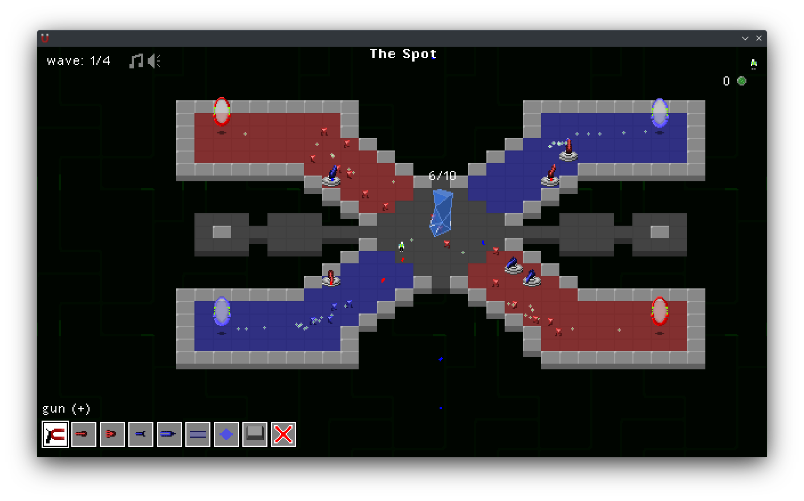

# MAG(net)
> Machines Assault Gem's Necessary Embryonic Tanks

Defend the embryonic core from the onslaught of magnetic robottos!

This is a tower defense game written for the first [ebitengine game jam](https://itch.io/jam/ebiten-game-jam).

## Features
  * Networked co-op play!
  * Polarity-based enemies and weapons.
  * Wave-based combat!
  * Easily written levels and enemy data types.
  * Customizable turrets, players, and more!
  * English/Japanese localization! (WIP)

## Level Editing
If you want to add or edit levels, it is easier to use a tool like [this](https://kettek.net/s/ediTTY/) to create them. Levels use a simple syntax for defining features and ASCII for map tiles.

## Building
Either issue `go run . build` or `go build ./cmd/magnet`. This will produce either `magnet` or `magnet.exe` depending on system.

## Development
Automatic watching and rebuilding can be done by issuing `go run . watch`. Restart this command after adding any new files to the project.
